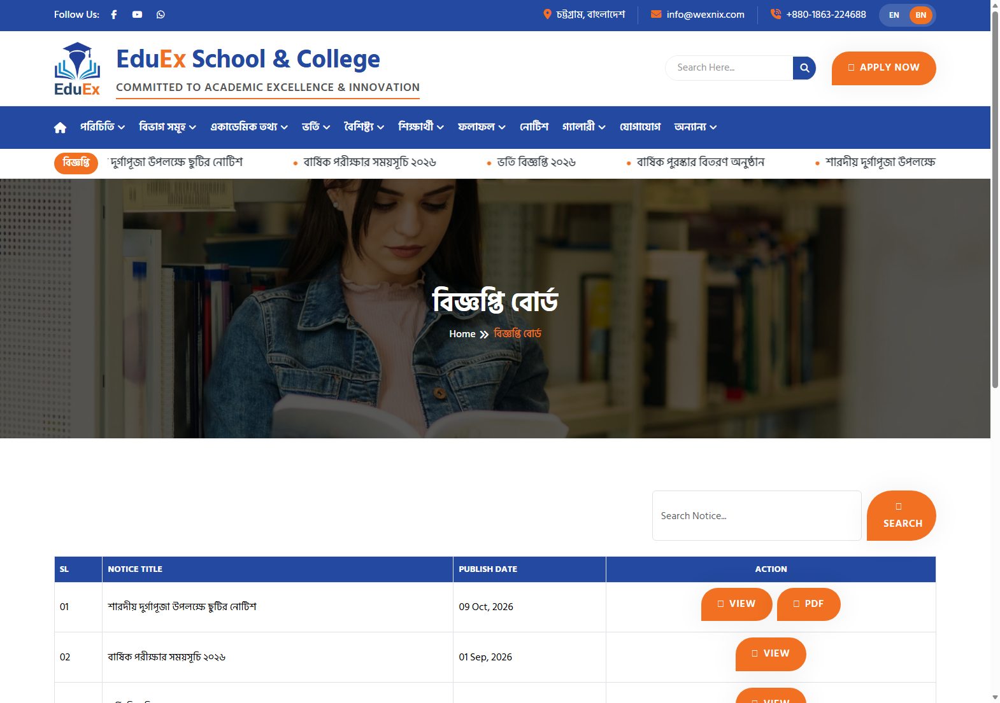
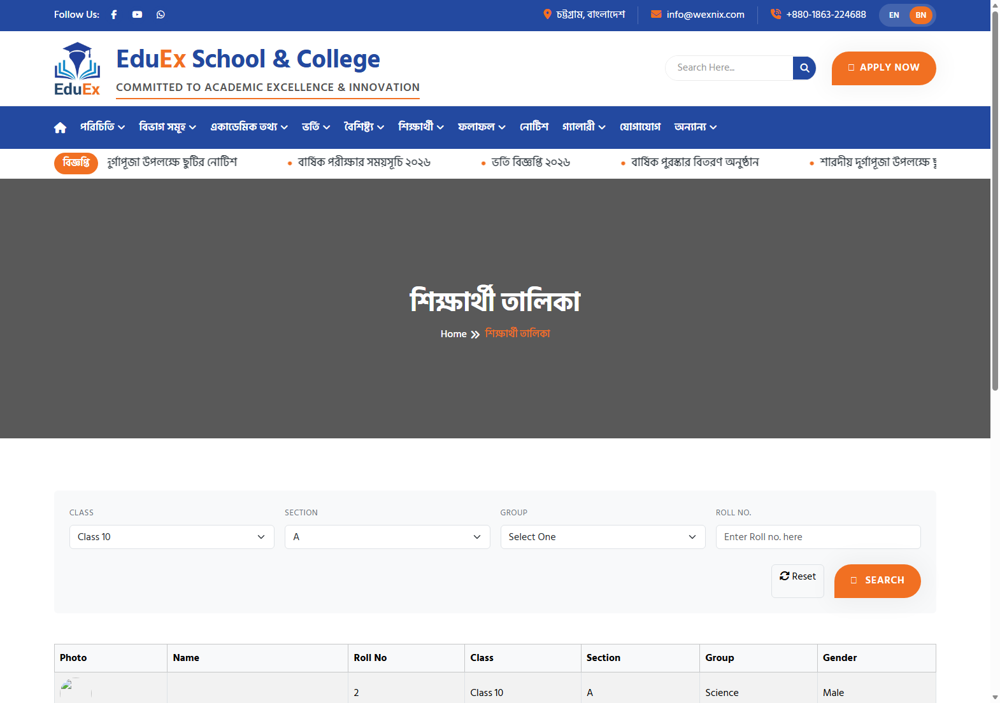
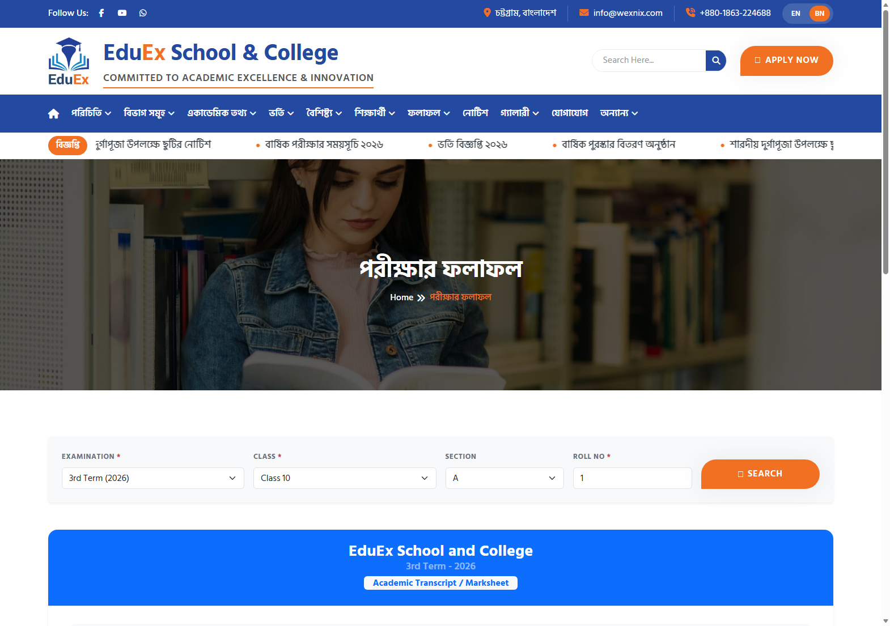
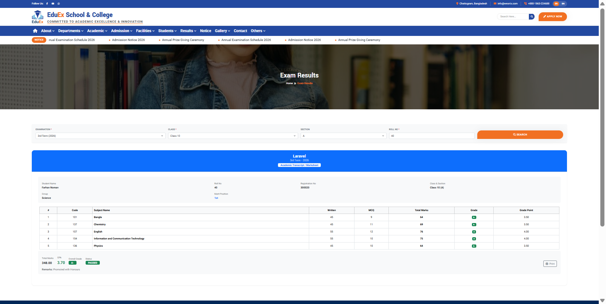
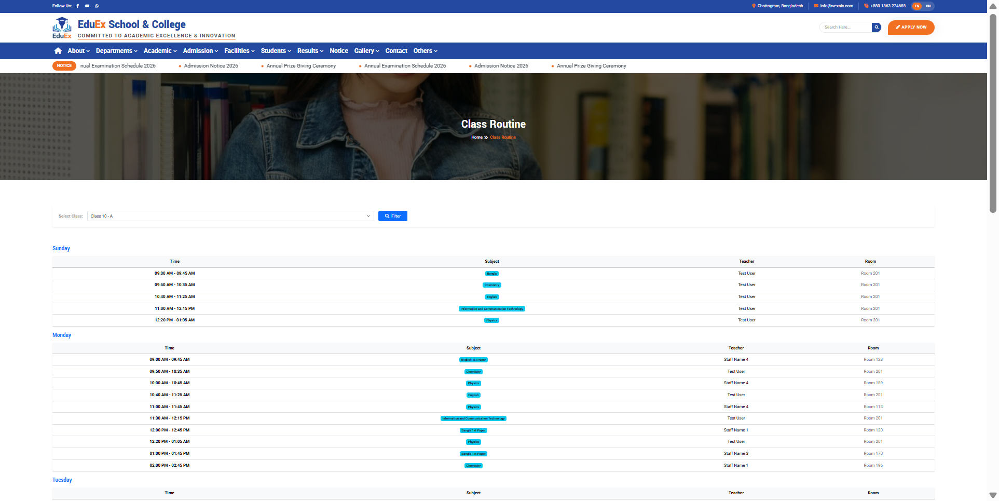

# School Desktop Software Data Integration Walkthrough

## Summary of Accomplished Work
We parsed, structured, and integrated all exported records from [`docs/software_data.md`](file:///d:/laragon-new/laragon/www/school-management/docs/software_data.md) into the Laravel school management system.

1. **Structured Data Preservation**: Parsed all markdown data and created a permanent JSON file at [`docs/software_data.json`](file:///d:/laragon-new/laragon/www/school-management/docs/software_data.json) containing metadata, notice, students, subject mappings, results, and routines.
2. **Notice Data & Official PDF**:
   - Ingested Notice 39 (*Notice of Durga Puja Holiday*) into the `notices` table with multilingual translations (EN, BN, AR).
   - Generated an official PDF document at `public/Notice/Notice of Durga Puja Holiday_20261009112952.pdf` and `storage/app/public/Notice/` so viewing and downloading the notice works seamlessly.
   - Cleared the top marquee ticker cache; the notice now rolls live in the header.
3. **Student Directory**:
   - Ingested all 10 students (Rolls 1, 3, 4, 10, 11, 12, 13, 14, 15, 16) into **Class 10, Section A, Science**.
   - Created individual portrait photos for all 10 students placed at `public/STD_Image/Ten-A-{roll}.jpg` and `public/storage/STD_Image/`.
4. **Student Exam Results**:
   - Linked **Jannat Khan** (Roll 10, System ID 7411) with her exact exported marks for 5 subjects (Bangla: 65, English: 55, General Math: 54, Physics: 69, ICT: 56 $\rightarrow$ Total: 299/500, GPA: 3.20, Grade: B).
   - Generated realistic 3rd Term 2026 marksheet records for all 9 classmates (e.g. Roll 1 Rafsan Hossain: Total 420/500, GPA 5.00, Grade A+).
   - Combined with previous student **Farhan Noman** (Roll 40: Total 348/500, GPA 3.70, Grade A-), the entire class is fully populated with report cards.
5. **Class Routines**: Configured 25 weekly timetable slots for Class 10 Section A across all 5 subjects with active teachers.
6. **Automation**: Created [`App\Services\SoftwareDataImporter`](file:///d:/laragon-new/laragon/www/school-management/app/Services/SoftwareDataImporter.php), Artisan command `php artisan software:import-data`, and seeder `SoftwareDataSeeder`.

---

## Visual Verification & Live Screenshots

### 1. Notice Board & Homepage Marquee
- **URL**: [`http://127.0.0.1:8000/notices`](http://127.0.0.1:8000/notices)
- Notice 39 *Notice of Durga Puja Holiday* published on 2026-10-09 with "Download Notice" PDF button.



- **Homepage Marquee**: [`http://127.0.0.1:8000/`](http://127.0.0.1:8000/)
- Header ticker immediately displays the new Durga Puja Holiday notice.


---

### 2. Student Directory (Class 10, Section A)
- **URL**: [`http://127.0.0.1:8000/students?class_id=5&section_id=9`](http://127.0.0.1:8000/students?class_id=5&section_id=9)
- All students rendered with working portraits, bilingual names, and roll badges.



---

### 3. Student Marksheets & Exam Results (3rd Term 2026)

#### A. Jannat Khan (Roll 10, System ID 7411) — Exact Software Marks
- **URL**: [`http://127.0.0.1:8000/results?exam_id=5&class_id=5&section=A&roll_no=10`](http://127.0.0.1:8000/results?exam_id=5&class_id=5&section=A&roll_no=10)
- Verified: Bangla (65), English (55), General Math (54), Physics (69 with 16 Lab marks), ICT (56). Total: 299 / 500 | GPA: 3.20 | Grade: B.


#### B. Rafsan Hossain (Roll 1, System ID 7410) — 1st Merit Position
- **URL**: [`http://127.0.0.1:8000/results?exam_id=5&class_id=5&section=A&roll_no=1`](http://127.0.0.1:8000/results?exam_id=5&class_id=5&section=A&roll_no=1)
- Verified: Total: 420 / 500 | GPA: 5.00 | Grade: A+ | Merit: 1st.



#### C. Farhan Noman (Roll 40, System ID 21) — Previous Export
- **URL**: [`http://127.0.0.1:8000/results?exam_id=5&class_id=5&section=A&roll_no=40`](http://127.0.0.1:8000/results?exam_id=5&class_id=5&section=A&roll_no=40)
- Verified: Total: 348 / 500 | GPA: 3.70 | Grade: A-.



---

### 4. Class Routine Timetable
- **URL**: [`http://127.0.0.1:8000/class-routine?class=5-9`](http://127.0.0.1:8000/class-routine?class=5-9)
- Weekly schedule across Sunday to Thursday with all 5 subjects, time slots, and assigned teachers.



---

## User Verification & Testing Guide

You can test and verify all data at the following URLs:

| Functionality | Direct URL | Verification Criteria |
| :--- | :--- | :--- |
| **Notice List** | [`/notices`](http://127.0.0.1:8000/notices) | "Notice of Durga Puja Holiday" appears at the top. |
| **Notice Details & PDF** | [`/notices/notice-of-durga-puja-holiday`](http://127.0.0.1:8000/notices/notice-of-durga-puja-holiday) | Click "Download Notice" to open the official PDF. |
| **Marquee Ticker** | [`/`](http://127.0.0.1:8000/) | Header marquee rolls with the Durga Puja notice. |
| **Student Directory** | [`/students?class_id=5&section_id=9`](http://127.0.0.1:8000/students?class_id=5&section_id=9) | View all Class 10-A students with their photos. |
| **Student Filter (Roll 10)** | [`/students?class_id=5&section_id=9&roll_no=10`](http://127.0.0.1:8000/students?class_id=5&section_id=9&roll_no=10) | Jannat Khan profile card. |
| **Student Filter (Roll 40)** | [`/students?class_id=5&section_id=9&roll_no=40`](http://127.0.0.1:8000/students?class_id=5&section_id=9&roll_no=40) | Farhan Noman profile card. |
| **Marksheet (Jannat)** | [`/results?exam_id=5&class_id=5&section=A&roll_no=10`](http://127.0.0.1:8000/results?exam_id=5&class_id=5&section=A&roll_no=10) | 5 subjects, 299 marks, GPA 3.20, Grade B. |
| **Marksheet (Rafsan)** | [`/results?exam_id=5&class_id=5&section=A&roll_no=1`](http://127.0.0.1:8000/results?exam_id=5&class_id=5&section=A&roll_no=1) | 5 subjects, 420 marks, GPA 5.00, Grade A+. |
| **Marksheet (Farhan)** | [`/results?exam_id=5&class_id=5&section=A&roll_no=40`](http://127.0.0.1:8000/results?exam_id=5&class_id=5&section=A&roll_no=40) | 5 subjects, 348 marks, GPA 3.70, Grade A-. |
| **Class Routine** | [`/class-routine?class=5-9`](http://127.0.0.1:8000/class-routine?class=5-9) | Timetable for Class 10 - Section A. |
| **Permanent JSON File** | [`docs/software_data.json`](file:///d:/laragon-new/laragon/www/school-management/docs/software_data.json) | Complete structured JSON dataset. |

---

## CLI Commands for Re-running or Seeding

- Run the software import command:
  ```bash
  php artisan software:import-data
  ```
- Or run the database seeder:
  ```bash
  php artisan db:seed --class=SoftwareDataSeeder
  ```
